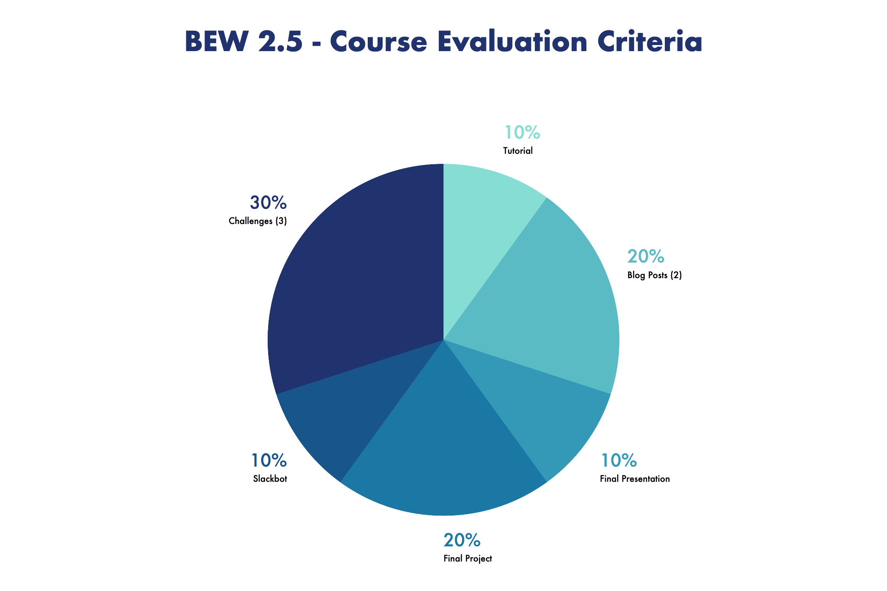

# BEW2.5: Patterns & Practices in Strongly Typed Languages

|                  Guide                   |    Slack     | Shortlink | Office Hours | Instructor 1-on-1 |
| :--------------------------------------: | :----------: | :--------------------------------------: | :-----------------------------------------------: |  :----------: |
| [**@droxey**](https://github.com/droxey) | `#bew2-5-go` | [make.sc/bew2.5](https://make.sc/bew2.5) | Thursday 1:30 - 2:15pm (Aspen) |  [Click to Schedule](https://make.sc/codewithdani) |

### Table of Contents

1. [Course Description](#course-description)
2. [Prerequisites](#prerequisites)
3. [Learning Objectives](#learning-objectives)
4. [Schedule](#schedule)
5. [Evaluation](#evaluation)
6. [Course Deliverables](#course-deliverables)
7. [Additional Resources](#additional-resources)
8. [Make School Course Policies](#make-school-course-policies)

## Course Description

In this course, students discover the value of strongly typed languages in server-side architectures, and dive deep into performant, concurrent programming paradigms present in Go. Known best for it's ability to blend the expressive features of dynamic languages (Python, JavaScript) with the performance capabilities of compiled languages (C, C++), students will gain the syntactic diversity required in today's large-scale platform engineering pursuits. Throughout the course, students will learn and implement the design patterns and best practices that make Go a top choice at high-velocity startups like Lyft, Heroku, Docker, Medium, and more!

## Prerequisites

- [BEW 1.1](https://make.sc/bew1.1)
- [BEW 1.2](https://make.sc/bew1.2)

## Learning Objectives

1. Design and implement command line interfaces, APIs, and bots in Go.
2. Identify and describe the architectures wherein the features of Golang could be best utilized.
3. Build data structures that support unmarshalling JSON retrieved from third-party APIs.
4. Apply Object Relational Mapping techniques to persist data to relational databases in Go.
5. Examine benchmarks to determine how to improve the speed and readability of a Golang project.
6. Gain experience deploying APIs and bots to production.

## Schedule

**Course Dates:** Tuesday, January 21 – Thursday, March 5, 2020 (7 weeks) 
**Class Times:** Tuesday and Thursday at 2:30–5:15pm (14 class sessions)

| Class |       Date       | Topics                                                                    |
| :---: | :--------------: | ------------------------------------------------------------------------- |
|   1   | Tue, January 21  | Intro to Go / Tutorial Launch                                             |
|   2   | Thu, January 23  | **[Tutorial Launch](Lessons/Lesson02.md)**                                |
|   3   | Tue, January 28  | **[Static Site Generators](Lessons/SSGProject.md)**                       |
|   4   | Thu, January 30  | **[Files & Directories](Lessons/FilesDirectories.md)**                    |
|   5   | Tue, February 4  | **[Fast Functionality via 3rd Party Libraries](Lessons/3rdPartyLibs.md)** |
|   6   | Thu, February 6  | **[Scraping the Web](Lessons/WebScraping.md)**                            |
|   7   | Tue, February 11 | **[Working With JSON](Lessons/JSON.md)**                 |
|   8   | Thu, February 13 | **[Echo](Lessons/Lesson04.md)**                       |
|   9   | Tue, February 18 | **[GORM](Lessons/Lesson06.md)**                                                           |
|  10   | Thu, February 20 | **[Concurrency & Goroutines](Lessons/Lesson07.md)**                         |
|  11   | Tue, February 25 |  **[Go Design Patterns](Lessons/DesignPatterns.md)** + Final Project Kickoff                      |
|  12   | Thu, February 27 | **[Documentation & Deployments](Lessons/DocsDeploy.md)**                  |
|  13   |   Tue, March 3   | **[Benchmarking & Testing](Lessons/Lesson09.md)**                                                               |
|  14   |   Thu, March 5   | Final Presentations                                                       |

## Evaluation

  

**To pass this course you must meet the following requirements**:

- Complete the tutorial assigned in class
- Write and publish one (1) blog post to Medium, dev.to, or a personal blog website
- Complete all challenges assigned in class
- Actively participate in class and abide by the attendance policy
- Make up all classwork from all absences
- Complete the final project according to the associated [project rubric](Project/MakeUtility.md), delivered to the class on the final day of the course

## Course Deliverables

*Assignments **must** be submitted to Gradescope by **11:59PM PST** on the date due.*

| 📚   Assignment                                      | 🔗   Criteria                                                 | 📆   Due Date                                                 |
| :-------------------------------------------------- | ------------------------------------------------------------ | ------------------------------------------------------------ |
| **[Tour of Go](https://tour.golang.org/welcome/1)** | Done in Class                                                | January 23, 2020 *(Thursday)*                                |
| **Static Site Generator**                           | [MVP](https://github.com/Make-School-Labs/makesite#mvp)   [v1.1](https://github.com/Make-School-Labs/makesite#v1.1) / [v1.2](https://github.com/Make-School-Labs/makesite#v1.2) | <u>MVP</u>: February 6, 2020 *(Thursday)* <u>v1.1</u> / <u>v1.2</u>: February 11, 2020 *(Tuesday)* |
| **Web Scraper**                                     |   [Requirements](https://make.sc/makescraper)                                        | February 20, 2020 (*Thursday*)                               |
| **Slackbot**                                        | [Requirements](https://github.com/droxey/goslackit)                                      |      February 27, 2020 (*Thursday*)                                                         |
| **Blog Post**                                       | [Rubric](https://docs.google.com/document/d/1T1oqHFoRo0kl7mPUTFupmsoEkLYltKsVgtqyGKDaCgY/edit) | March 6, 2020 *(Friday)*                                     |
| **MakeUtility Project**                             | [Requirements](https://make.sc/makeutility)                  | March 6, 2020 *(Friday)*                                     |

## Additional Resources

- [Gophercises](https://gophercises.com/): Real-world side projects with video tutorials!
- [TutorialEdge - Golang Repository](https://github.com/elliotforbes/tutorialedge-v2/tree/master/content/golang): Mini-tutorials to introduce and enhance your Golang knowledge.
- [YouTube - Todd Mcleod](https://www.youtube.com/user/toddmcleod/playlists): Videos to reinforce Golang concepts and techniques that we cover in class.
- [Echo Framework](https://echo.labstack.com/guide): Documentation for Echo, a high performance, extensible, minimalist Go web framework.
- [GORM](http://doc.gorm.io/#): The fantastic ORM library for Golang.

## Make School Course Policies

- [Program Learning Outcomes](https://make.sc/program-learning-outcomes) - What you will achieve after finishing Make School, all courses are designed around these outcomes.
- [Grading System](https://make.sc/grading-system) - How grading is done at Make School
- [Diversity and Inclusion Statement](https://make.sc/diversity-and-inclusion-statement) - Learn about Diversity and Inclusion at Make School
- [Academic Honesty](https://make.sc/academic-honesty-policy) - Our policies around plagerism, cheating, and other forms of academic misconduct
- [Attendance Policy](https://make.sc/attendance-policy) - What we expect from you in terms of attendance for all classes at Make School
- [Course Credit Policy](https://make.sc/course-credit-policy) - Our policy for how you obtain credit for your courses
- [Disability Services (Academic Accommodations)](https://make.sc/disability-services) - Services and accommodations we provide for students
- [Student Handbook](https://make.sc/student-handbook) - Guidelines, policies, and resources for all Make School students
