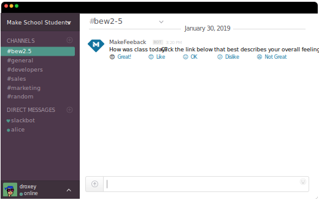

# Intro to Golang

**BEW2.5**<br>_Patterns & Practices in Strongly Typed Ecosystems_

---

## Objectives<br>(5 Minutes)<br><br>

1. Complete course overview and **syllabus review**.
1. Learn about why people are excited about **Golang** in 2019.
1. **Install Go locally** and write our **first application**.

---

## Course Overview<br>(25 Minutes)<br><br>

* We will use Go to **solve common problems** experienced by students and staff **at Make School**.

* By the end of the course, you'll have a **complete suite of `makeschoolutils` that solve numerous problems found in industry**.

~~~

### Syllabus

Visit [make.sc/bew2.5](make.sc/bew2.5) for the latest syllabus.

All class materials can be found at the above shortlink.

~~~

### Textbooks

* Syntax: [Effective Go](https://golang.org/doc/effective_go.html)
* Recipes: [Go by Example](https://gobyexample.com)

~~~

### Tutorial

#### MakeFeedback

_Coming soon!_



~~~

### Homework

**~5 hours** of homework:

1. **Gophercises**: [_Link Shortener_](https://gophercises.com/exercises/urlshort)
1. **Gophercises**: [_Quiet HN_](https://gophercises.com/exercises/quiet_hn)
1. **Gophercises**: [_Image Transform Service_](https://gophercises.com/exercises/transform) _(BONUS)_


~~~

### Final Project

#### `makeutility`

Create your own utility and integration using Go!

~~~

### Grading Criteria

**_TO PASS, ALL SUBMITTED WORK MUST..._**

1. Be **complete**.
1. Score a **B or higher** on **[Go Report Card](https://goreportcard.com)**.
1. Have **10 or more commits** in a public GitHub repo.

~~~

### Q&A

---

## Why Go?<br>(5 Minutes)<br><br>

<table>
  <tr>
    <td>GoDoc</td>
    <td>Static code analysis</td>
  </tr>
  <tr>
    <td>Built-in testing and profiling framework</td>
    <td>Race condition detection</td>
  </tr>
  <tr>
    <td>Learning curve</td>
    <td>Reflection</td>
  </tr>
  <tr>
    <td>Opinionatedness</td>
    <td>Culture</td>
  </tr>
</table>

---

## Syntax Overview<br>(20 Minutes)<br><br>

Let's learn about the syntax of Go using [Devhints](https://devhints.io/go).

---

## BREAK<br>(10 Minutes)

---

## Get Started With Go<br>(25 Minutes)

~~~

### Installing Go

1. Visit the [downloads](https://golang.org/dl/) page and choose macOS.
2. Double click the downloaded `.pkg` and install.


~~~

### Testing Your Installation

~~~

#### Set Up GOPATH

```bash
cd ~
mkdir go
cd go
```

~~~

#### Hello World

1. `mkdir -p /src/hello`
1. Create a file named `hello.go` and paste the following code:
    ```golang
    package main

    import "fmt"

    func main() {
      fmt.Printf("hello, world\n")
    }
    ```
1. Build `hello.go`:
    ```bash
    $ cd $HOME/go/src/hello
    $ go build
    ```
1. Run it:
    ```bash
    $ ./hello
    hello, world
    ```
    If you see the `hello, world` message then your Go installation is working.

~~~

## Congrats!

**You've written, built, and ran your first Go application!**

---

## Daily Deliverable<br>(15 Minutes)

### Personal Learning Objective

* Write **one sentence describing a goal you want to reach by the end of this course**.

* Turn it in to Dani at the **end of the class period**.

* I will be **tracking and discussing this goal** with you **throughout the course**.

---
